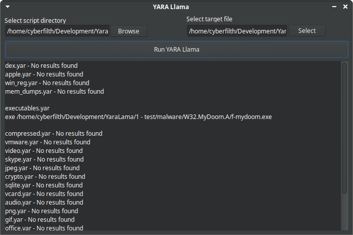

# YARA-Llama
A GUI for YARA malware pattern matching tool

  

YARA Llama requires YARA to be installed, it's a simple front-end that allows you to select a directory of .yar scripts when analysing potential malware.
The YARA Forensics repo at <https://github.com/Xumeiquer/yara-forensics> is a good source of scripts.

This version of YARA Llama currently only works on Linux.

